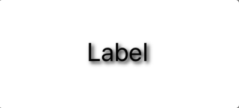
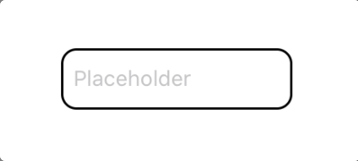
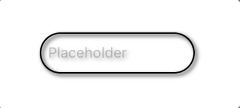
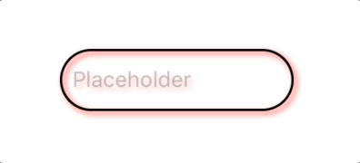
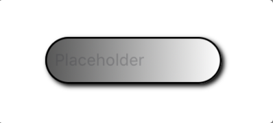

# ADVHelper

[](https://cocoapods.org/pods/ADVHelper)
[](https://cocoapods.org/pods/ADVHelper)
[](https://cocoapods.org/pods/ADVHelper)
[](https://cocoapods.org/pods/ADVHelper)

## Requirements

iOS 12.0 or above

## Installation

ADVHelper is available through [CocoaPods](https://cocoapods.org). To install
it, simply add the following line to your Podfile:

```ruby
pod 'ADVHelper'
```

## Usage

### - ADVHelper

#### Using ADVHelper programmatically

Import ADVHelper at the top of each Swift file that will be used.

```swift
import ADVHelper
```

### - Localize

#### Using Localize programmatically

Add `.localized()` following any `String` object you want translated:
```swift
let _ = "String".localized()
```

To change the current language:
```swift
Localize.setCurrentLanguage("th")
```

To update the UI in the view controller where a language change can take place, observe LCLLanguageChangeNotification:
```swift
NotificationCenter.default.addObserver(self, selector: #selector(setText), name: NSNotification.Name(LCLLanguageChangeNotification), object: nil)
```

Example function `setText()`

```swift
@objc func setText() {
    titleLabel.localizeKey = "String".localized()
    textFieldBox.localizeKey = "String".localized()
    textViewBox.localizeKey = "String".localized()
    buttonBtn.localizeKey = "String".localized()
}
```

### - String Extension

#### Using String Extension programmatically

###### - DateFormatter

- Function `dateFormat` for set output `format`
  
In this function, it supports the input formats `yyyy-MM-dd HH: mm: ss` and `yyyy-MM-dd`. And default local date for input `en`. And local date for output are based on `Localize Language`.
  
Example input date
```swift
let inputDateStr = "2020-06-17 10:20:30"
```
  
Example of use
```swift
titleLabel.text = inputDateStr.dateFormat(format: "dd/MM/yyyy HH:mm")
```
  
Output
```
17/06/2020 10:20
```
  
- Function `dateFormat` for set `fromFormat` and `toFormat`
  
In this function, it default local date for input `en`. And local date for output are based on `Localize Language`.
  
Example input date
```swift
let inputDateStr = "2020-06-17 10:20:30"
```
  
Example of use
```swift
titleLabel.text = inputDateStr.dateFormat(fromFormat: "yyyy-MM-dd HH:mm:ss", toFormat: "dd/MM/yyyy HH:mm")
```
  
Output
```
17/06/2020 10:20
```

- Function `dateFormat` for set `fromFormat` `toFormat` and `toLocaleIdentifier`
  
In this function, it default local date for input `en`.
  
Example input date
```swift
let inputDateStr = "2020-06-17 10:20:30"
```
  
Example of use
```swift
titleLabel.text = inputDateStr.dateFormat(fromFormat: "yyyy-MM-dd HH:mm:ss", toFormat: "dd/MM/yyyy HH:mm", toLocaleIdentifier: "th")
```
  
Output
```
17/06/2563 10:20
```

- Function `dateFormat` for all set `fromFormat` `fromLocaleIdentifier` `toFormat` and `toLocaleIdentifier`
  
Example input date
```swift
let inputDateStr = "2563-06-17 10:20:30"
```
  
Example of use
```swift
titleLabel.text = inputDateStr.dateFormat(fromFormat: "yyyy-MM-dd HH:mm:ss", fromLocaleIdentifier: "th", toFormat: "dd/MM/yyyy HH:mm", toLocaleIdentifier: "en")
```
  
Output
```
17/06/2020 10:20
```

### - Button

#### Using Button programmatically

###### - Localize

Define text with `localizeKey`
```swift
buttonBtn.localizeKey = "Button".localized()
```

###### - Loading


To show a loader inside the button, and enable or disable user interection while loading

```swift
buttonBtn.showLoader()
```

To hide a loader

```swift
buttonBtn.hideLoader()
```

#### Using Button in Storyboard

The steps for use
1. Drag a UIButton into Storyboard.
2. Set class to `Button`
3. Set up attributes inspection.

###### - Border


Parameter | Type | Description | Default 
------------ | ------------- | ------------- | ------------- 
borderColor | UIColor  | The color of the layer’s border.  | UIColor.clear 
borderWidth | CGFloat  | The width of the layer’s border.  | 0 

###### - Corner Radius

 

Parameter | Type | Description | Default 
------------ | ------------- | ------------- | ------------- 
cornerRadius | CGFloat  | The radius to use when drawing rounded corners for the layer’s background.  | 0 

###### - Shadow

 

Parameter | Type | Description | Default 
------------ | ------------- | ------------- | ------------- 
shadowColor | UIColor  | The color of the layer’s shadow. | UIColor.clear 
shadowOpacity | Float  | The opacity of the layer’s shadow. | 0 
shadowOffset | CGSize  | The offset (in points) of the layer’s shadow. | CGSize.zero 
shadowRadius | CGFloat  | The blur radius (in points) used to render the layer’s shadow. | 0 

###### - Gradient Background

 

Parameter | Type | Description | Default 
------------ | ------------- | ------------- | ------------- 
gradientEnabled | Bool  | Enable gradient background.  | false 
gradientStartColor | UIColor  | Start color gradient background.  | UIColor.clear 
gradientEndColor | UIColor  | End color gradient background.  | UIColor.clear 
gradientHorizontal | Bool  | Is the horizontal gradient background.  | false 

###### - Click Animate

 

Parameter | Type | Description | Default 
------------ | ------------- | ------------- | ------------- 
animatedScaleWhenHighlighted | CGFloat  | Animation scale when highlighted.  | 1.0 
animatedScaleDurationWhenHighlighted | Double  | Animation scale duration when highlighted.  | 0.2 

###### - Ripple

  

Parameter | Type | Description | Default 
------------ | ------------- | ------------- | ------------- 
ripple | Bool  | Enable ripple animation.  | false 
rippleColor | UIColor  | The color of the ripple animation.  | UIColor(white: 1.0, alpha: 0.3) 
rippleSpeed | Double  | The speed of the ripple animation.  | 1.0 

###### - Image

   

Parameter | Type | Description | Default 
------------ | ------------- | ------------- | ------------- 
imageViewContentMode | Int  | Options to specify how a view adjusts its content when its size changes. * [ContentMode](https://developer.apple.com/documentation/uikit/uiview/contentmode) | 0 
imageAlpha | CGFloat  | The image view's alpha value. | 1.0 

###### - Underline


Parameter | Type | Description | Default 
------------ | ------------- | ------------- | ------------- 
isUnderline | Bool  | Enable underline.  | false 

### - Label

#### Using Label programmatically

###### - Localize

Define text with `localizeKey`
```swift
titleLabel.localizeKey = "Label".localized()
```

#### Using Label in Storyboard

The steps for use
1. Drag a UILabel into Storyboard.
2. Set class to `Label`
3. Set up attributes inspection.

###### - Border


Parameter | Type | Description | Default 
------------ | ------------- | ------------- | ------------- 
borderColor | UIColor  | The color of the layer’s border.  | UIColor.clear 
borderWidth | CGFloat  | The width of the layer’s border.  | 0 

###### - Corner Radius

 

Parameter | Type | Description | Default 
------------ | ------------- | ------------- | ------------- 
cornerRadius | CGFloat  | The radius to use when drawing rounded corners for the layer’s background.  | 0 

###### - Shadow

 

Parameter | Type | Description | Default 
------------ | ------------- | ------------- | ------------- 
shadowColor | UIColor  | The color of the layer’s shadow. | UIColor.clear 
shadowOpacity | Float  | The opacity of the layer’s shadow. | 0 
shadowOffset | CGSize  | The offset (in points) of the layer’s shadow. | CGSize.zero 
shadowRadius | CGFloat  | The blur radius (in points) used to render the layer’s shadow. | 0 

###### - Underline

 

Parameter | Type | Description | Default 
------------ | ------------- | ------------- | ------------- 
isUnderline | Bool  | Enable underline.  | false 

### - TextField

#### Using TextField programmatically

###### - Localize

Define placeholder with `localizeKey`
```swift
textFieldBox.localizeKey = "Placeholder".localized()
```

#### Using TextField in Storyboard

The steps for use
1. Drag a UITextField into Storyboard.
2. Set class to `TextField`
3. Set up attributes inspection.

###### - Border


Parameter | Type | Description | Default 
------------ | ------------- | ------------- | ------------- 
borderColor | UIColor  | The color of the layer’s border.  | UIColor.clear 
borderWidth | CGFloat  | The width of the layer’s border.  | 0 

###### - Corner Radius

 

Parameter | Type | Description | Default 
------------ | ------------- | ------------- | ------------- 
cornerRadius | CGFloat  | The radius to use when drawing rounded corners for the layer’s background.  | 0 

###### - Shadow

 

Parameter | Type | Description | Default 
------------ | ------------- | ------------- | ------------- 
shadowColor | UIColor  | The color of the layer’s shadow. | UIColor.clear 
shadowOpacity | Float  | The opacity of the layer’s shadow. | 0 
shadowOffset | CGSize  | The offset (in points) of the layer’s shadow. | CGSize.zero 
shadowRadius | CGFloat  | The blur radius (in points) used to render the layer’s shadow. | 0 

###### - Gradient Background

 

Parameter | Type | Description | Default 
------------ | ------------- | ------------- | ------------- 
gradientEnabled | Bool  | Enable gradient background.  | false 
gradientStartColor | UIColor  | Start color gradient background.  | UIColor.clear 
gradientEndColor | UIColor  | End color gradient background.  | UIColor.clear 
gradientHorizontal | Bool  | Is the horizontal gradient background.  | false 

###### - Padding

None | Left | Right | Left & Right
------------ | ------------- | ------------- | ------------- 
 |  |  |  

Parameter | Type | Description | Default 
------------ | ------------- | ------------- | ------------- 
paddingLeftCustom | CGFloat  | Pads the view along left edges by the specified amount. | 0 
paddingRightCustom | CGFloat  | Pads the view along right edges by the specified amount. | 0 

### - TextView

#### Using TextView programmatically

###### - Localize

Define placeholder with `localizeKey`
```swift
textViewBox.localizeKey = "Placeholder".localized()
```

#### Using TextView in Storyboard

The steps for use
1. Drag a UITextView into Storyboard.
2. Set class to `TextView`
3. Set up attributes inspection.

###### - Border


Parameter | Type | Description | Default 
------------ | ------------- | ------------- | ------------- 
borderColor | UIColor  | The color of the layer’s border.  | UIColor.clear 
borderWidth | CGFloat  | The width of the layer’s border.  | 0 

###### - Corner Radius


Parameter | Type | Description | Default 
------------ | ------------- | ------------- | ------------- 
cornerRadius | CGFloat  | The radius to use when drawing rounded corners for the layer’s background.  | 0 

###### - Maximum length

Parameter | Type | Description | Default 
------------ | ------------- | ------------- | ------------- 
maxLength | Int | The maximum character length. (0 means no limit) | 0 

###### - Trim

Parameter | Type | Description | Default 
------------ | ------------- | ------------- | ------------- 
trimWhiteSpaceWhenEndEditing | Bool | Trim whitespace and newline characters when end editing. | true 

###### - Height


Parameter | Type | Description | Default 
------------ | ------------- | ------------- | ------------- 
minHeight | CGFloat | The minimum height limit. (0 means no limit) | 0 
maxHeight | CGFloat | The maximum height limit. (0 means no limit) | 0 

## Example

To run the example project, clone the repo, and run `pod install` from the Example directory first.

## Author

nattaponph, nattaponph58@nu.ac.th

## License

ADVHelper is available under the MIT license. See the LICENSE file for more info.

## Credits

* [Kenneth Tsang](https://cocoapods.org/pods/GrowingTextView)
* [Roy Marmelstein](https://cocoapods.org/pods/Localize-Swift)
* [Taha Sönmez](https://medium.com/@mtssonmez/handle-empty-tableview-in-swift-4-ios-11-23635d108409)
